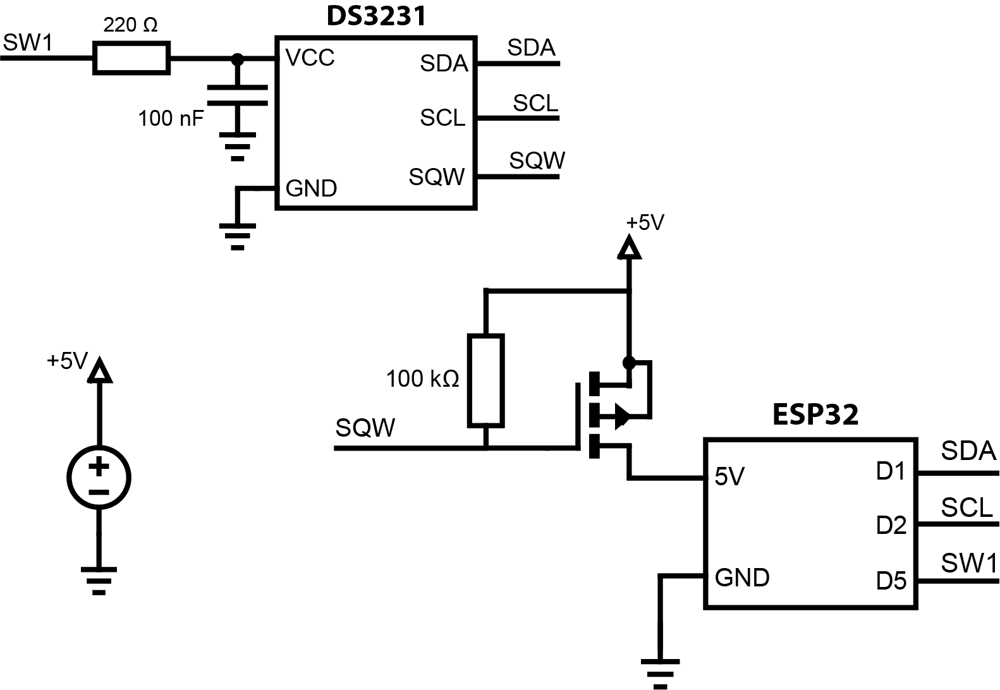

# :hocho:killswitch
## Introduction
This program keeps time on a DS3231 and uses the alarm line of the DS3231 and a P-CH MOSFET to cut/give power to an ESP32 and save the recorded time and temperature onto an SD card.
## Hardware
You need the following components to use this program:
- ESP32 or ESP32 development board (this program was tested on the ESP32-DevKitC-32D)
- [Adafruit DS3231 Precision RTC breakout](https://www.adafruit.com/product/3013)
- [DFRobot Micro SD Card Module for Arduino](https://www.dfrobot.com/product-875.html)
- Logic-level P-CH MOSFET (I use [this one](https://www.digikey.ch/product-detail/en/AOI21357/785-1836-ND/9951422?utm_medium=email&utm_source=oce&utm_campaign=3480_OCE21RT&utm_content=productdetail_CH&utm_cid=1200795&so=67534481&mkt_tok=eyJpIjoiWTJFeE1XWTNNbVE1WldReSIsInQiOiJJMFVWM0lvcWQzS2JVbHFVOEVZTmpGbFFjQnpXMlVtYTd5em1XU3pxckVXYmpUYUtCSkFFMHhNcGQ3RE5lOXFpYnJrVnJlenp1SzdlOXBwTFFQZWlhcmNGMGppcFk5YTRIWW1xcVg3UXE4UEtoREgwYmhtZnFkSEZhS1pkUytsUCJ9))
- Some resistors (1x 100k and 3x 10k)
## Code
Before you begin, you need the ESP-IDF installed on your computer. Please visit the [Espressif website](https://docs.espressif.com/projects/esp-idf/en/latest/esp32/get-started/) for more information on installation.

You also need the [ESP-IDF Component Library by @UncleRus](https://github.com/UncleRus/esp-idf-lib) in order to run this program
## Hookup and Schematics

